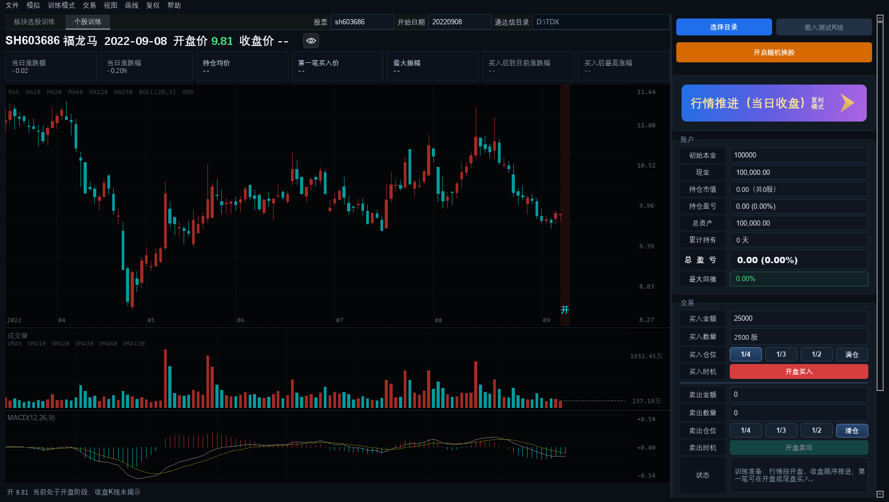
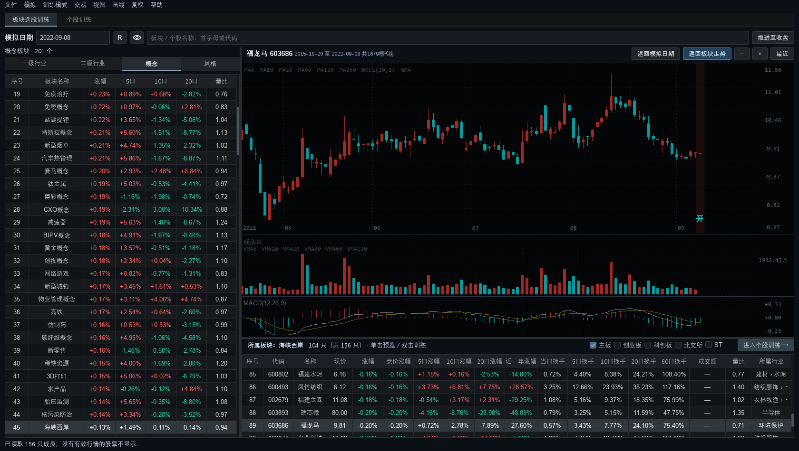
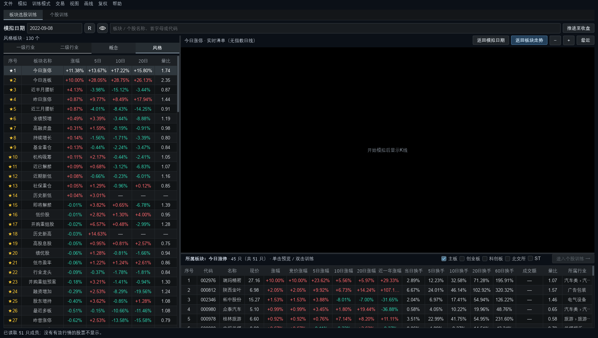

<h1 align="center">大A日K股票模拟训练器 · 板块选股版</h1>
<p align="center"><b>A-share Daily K-line Trading Simulator · Sector Edition</b></p>
<p align="center">V17 · Windows 10/11 · Python + PySide6 · 本地通达信行情</p>

> 用本地行情做「日K盲练」的 Windows 桌面训练软件：随机抽股票、随机抽历史日期，在看不到后续走势的情况下练买卖，练完再看成绩单。
>
> A Windows desktop trainer for blind practice on daily K-lines: it picks a random stock and a random historical date, so you make buy/sell decisions without seeing what happens next — and get a score report afterwards.

[简体中文](#界面预览) | [English](#english)

## 界面预览

### 个股训练



### 板块选股训练



### 风格选股（今日涨停 / 今日连板 / 腰斩等）



## 项目简介

本软件读取本机通达信的历史日K数据（没有通达信时使用内置示例数据），把某一根K线当成「今天」，让你在不知道后面怎么走的情况下做买卖决策，用来训练盘感和纪律。

V17 在个股训练之外增加了「板块选股训练」：按行业、概念、风格浏览板块，查看成分股与板块走势，再进入个股训练。

## 主要功能

### 个股训练

- 随机换股、随机定位历史日期，按「年 → 月 → 日」分层随机，并落在真实交易日上
- 支持手动输入股票代码和日期，或跳到最近、最早
- 日K主图加成交量、MACD 等副图；方向键平移，Ctrl+滚轮或 Ctrl+方向键缩放
- 买卖操作按 T+1 规则成交，记录资金、持仓、成本与盈亏
- 训练结束生成成绩单，历史成绩可回看并支持导出 Excel
- 续作会话：中途退出后可以继续之前的训练
- 临时测试与正式训练互相隔离，不会污染账户和成绩

### 板块选股训练

- 分类浏览：一级行业、二级行业、概念、风格，支持名称、代码、首字母搜索
- 成分股表格：现价、涨幅、开盘竞价涨幅、5/10/20 日涨幅、近一年涨幅、当日及 5/10/20/60 日换手率、成交额、量比、所属行业
- 名称后面的角标表示连板数，首板不显示角标
- 风格分类提供程序自行统计的「今日涨停 / 今日连板 / 今日跌停」，以及「近半月 / 近一月 / 近三月腰斩」（区间最高收盘价跌 40%~60%）
- 可按主板、创业板、科创板、北交所、ST 五类勾选筛选，随机换股也只在这个范围内抽取
- 点击序号可收藏板块或个股，收藏始终置顶，并随「保存当前配置」一起保存
- 双击分类标签或点击表头排序会回到列表顶部
- 板块页与个股页双向同步：在个股页随机到的股票，切到板块页会自动定位到它所在的板块并显示该股K线

### 行情与缓存

- 首次启动会预热板块目录和全市场行情，加载期间显示进度动画和随机投资语录
- 板块行情、复权K线、市场统计等都有本地缓存，之后启动更快，缓存可随时清理重建

## 运行环境

- Windows 10 / 11
- Python 3.10 及以上，PySide6（源码方式运行时需要）
- 通达信行情目录（可选，没有时使用内置示例数据）

## 快速开始

源码方式，双击项目根目录的 `运行.bat`，或者：

```bat
python -m pip install -r requirements.txt
python app.py
```

启动后在「文件 → 设置」里选择通达信安装目录，即可使用本机真实行情。

## 项目结构

```
app.py                     启动入口
stock_simulator/
  app.py                   主窗口、菜单、页面切换
  engine.py                模拟交易引擎（成交、持仓、T+1）
  session.py               训练会话、随机换股与随机日期
  kline_widget.py          日K主图与副图绘制
  performance.py           成绩统计与历史记录
  sectors/                 板块选股训练模块（板块列表、成分股、行情服务）
  sector_integration.py    板块页与主窗口的联动
  tdx_reader.py            通达信本地数据读取
  sample_data.py           内置示例数据
  portable_builder.py      生成免安装便携版
config/                    本机配置与缓存（缓存可重建）
tests/                     自动化测试
```

## 数据与缓存

- 源码模式数据目录：项目 `config` 文件夹
- 可重建缓存：`sector_cache`、`adjusted_bars_cache`、`gbbq_events`、`market_stats_daily.json`、`shanghai_index_daily.json`
- 请勿随意删除：`session_state.json`（续作会话）、`performance_history.json`（历史成绩）

## 常用快捷键

| 按键 | 作用 |
| --- | --- |
| Ctrl+F / Tab | 切换全屏 |
| Esc | 退出全屏 |
| R | 随机换股或随机定位日期 |
| 方向键 | 平移K线 |
| Ctrl+方向键 / Ctrl+滚轮 | 缩放K线 |
| B / S | 买入 / 卖出 |
| Home / Ctrl+→ | 回到最新K线 |
| End / Ctrl+← | 跳到最早K线 |
| 快速双击空格 | 叠加指数或板块指数 |

## 常见问题

- **第一次打开比较慢？** 首次需要生成板块和复权缓存，之后再启动会明显变快。
- **没有通达信数据能用吗？** 可以，软件自带示例K线，能完整体验训练流程。
- **能当炒股软件用吗？** 不能。它的定位是历史行情训练工具，不做实时行情和真实下单。

## 免责声明

本项目只用于个人学习与交易训练，行情来自本机通达信数据或公开数据源，不构成任何投资建议。

---

## English

**A-share Daily K-line Trading Simulator (Sector Edition, V17)** is a Windows desktop training tool. It loads local TDX (Tongdaxin) daily data, picks a random stock and a random historical date, and lets you make buy/sell decisions without seeing the future — then shows you a score report.

### Highlights

- **Single-stock training**: random stock and random date, B/S keys to trade, T+1 rules, position and P/L tracking, score reports with Excel export, resumable sessions.
- **Sector-based training**: browse level-1/level-2 industries, concepts and style categories; member lists with price, change, turnover, volume ratio and consecutive limit-up badges; built-in "today limit-up / consecutive limit-up / limit-down" and "halved within 15 / 25 / 70 trading days" style lists.
- **Filters and favourites**: filter by main board, ChiNext, STAR, Beijing Stock Exchange and ST (random stock picking honours the same filter); click the row number to favourite, favourites are pinned and saved with the configuration.
- **Charting**: daily candles with volume and MACD sub-charts, keyboard panning, Ctrl+wheel zoom, zoom level preserved when switching between pages.
- **Caching**: sector lists, adjusted bars and market statistics are cached locally so later launches are fast.

### Requirements

Windows 10/11, Python 3.10+, PySide6 (`pip install -r requirements.txt`). A local Tongdaxin directory is optional — built-in sample data is used when it is missing.

### Run

```bat
运行.bat
```

or

```bat
python -m pip install -r requirements.txt
python app.py
```

### Notes

Data lives in the local `config` folder in source mode. `sector_cache` and `adjusted_bars_cache` are rebuildable; `session_state.json` and `performance_history.json` are your records and should not be deleted.

This project is for personal study and trading practice only. It is not investment advice and it cannot place real orders.
